# 🌌 Private Vault (Password Manager)

[](https://opensource.org/licenses/MIT)
[]()
[]()

> A sleek, minimal, zero-trust password manager designed for self-hosting on shared environments (like cPanel) with **100% client-side encryption**. 

Your master password never leaves your browser, and the database only stores raw, encrypted cryptographic blobs. Even if your hosting provider or database is fully compromised, your passwords remain secure under **AES-256-GCM** encryption.

**Why store the database on a server?**
While cryptographic operations are handled client-side in the browser, storing the encrypted database blob on a self-hosted PHP server enables multi-device synchronization and protects your vault against aggressive browser cache clearings, keeping you in complete control of your hosting environment.

---

## 🎨 Screenshots & Interface

| 🔒 Secure Unlock Screen | 🔍 Search & Lookup View |
| :---: | :---: |
| 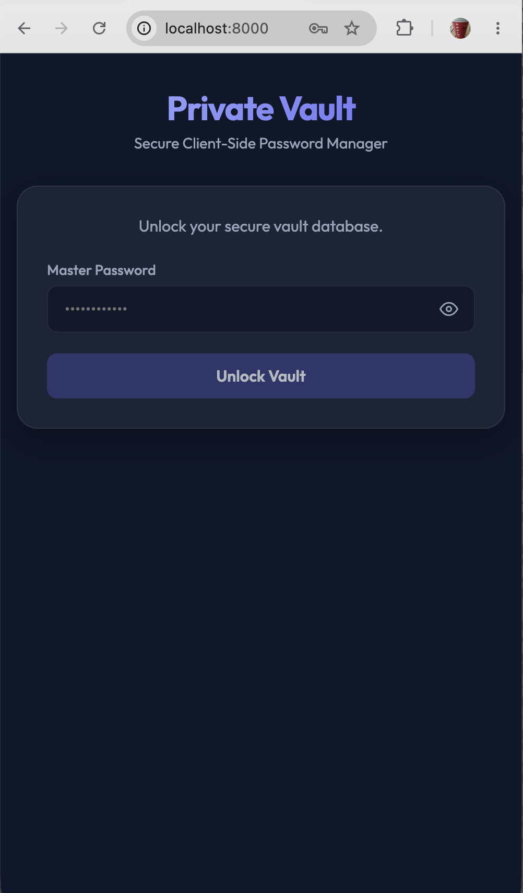 | 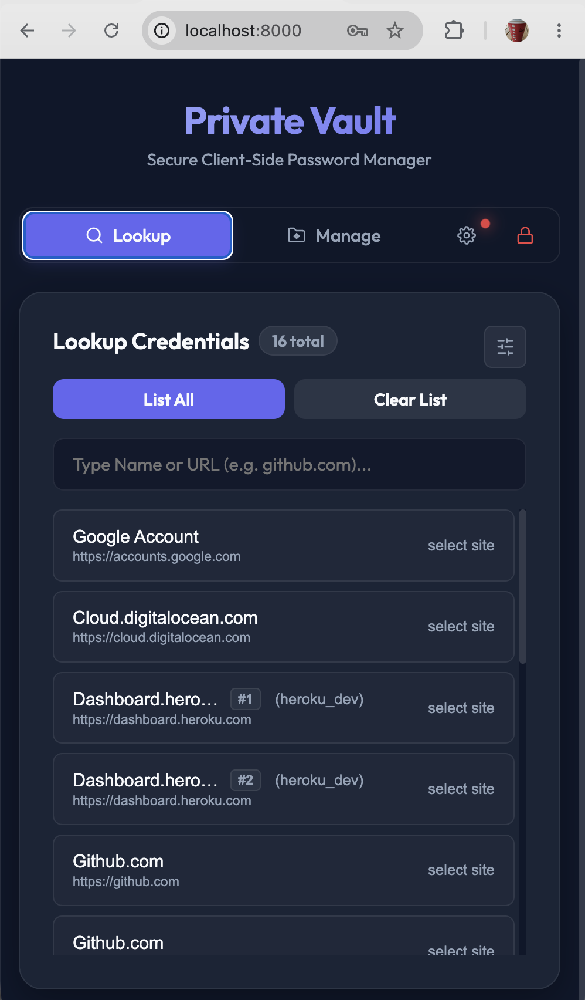 |

| 💳 Decrypted Credentials Card | ⚙️ Lookup Settings & Filters |
| :---: | :---: |
| 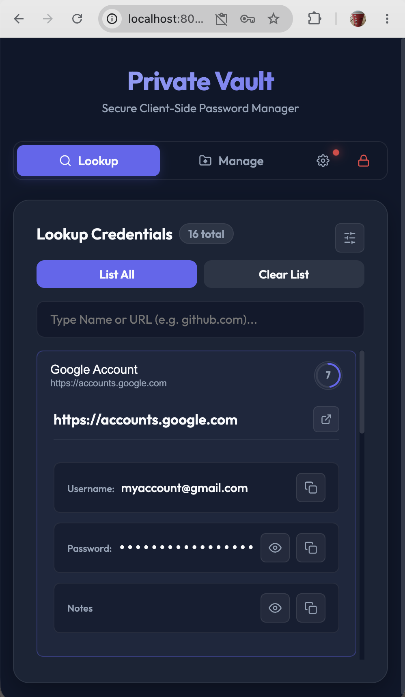 | 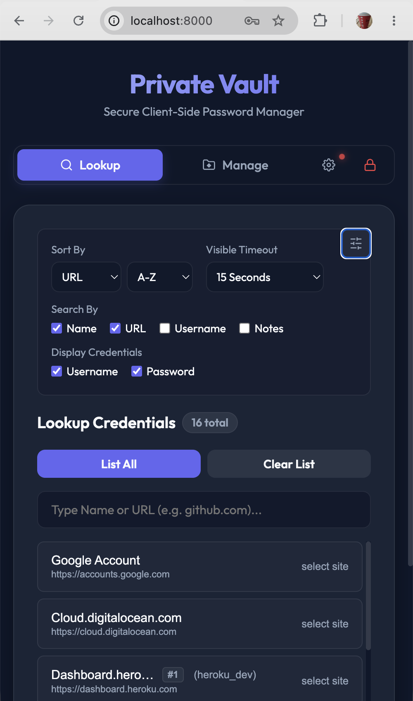 |

<details>
  <summary>📸 Click here to view all screenshots...</summary>

  | | |
  | :---: | :---: |
  | 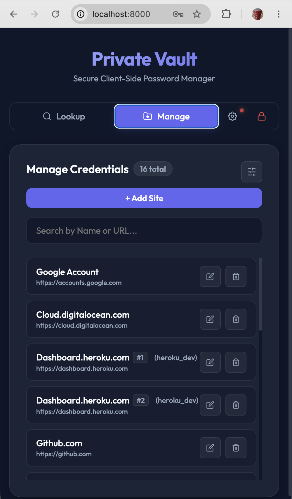 | 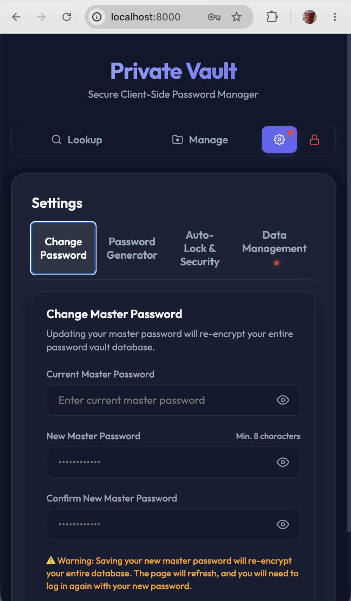 |
  | 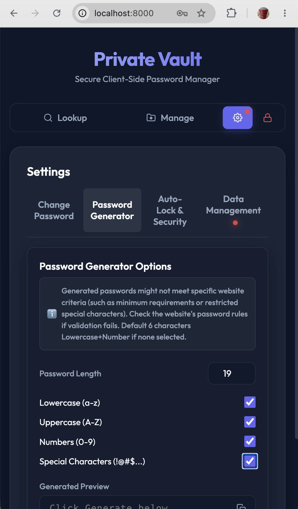 | 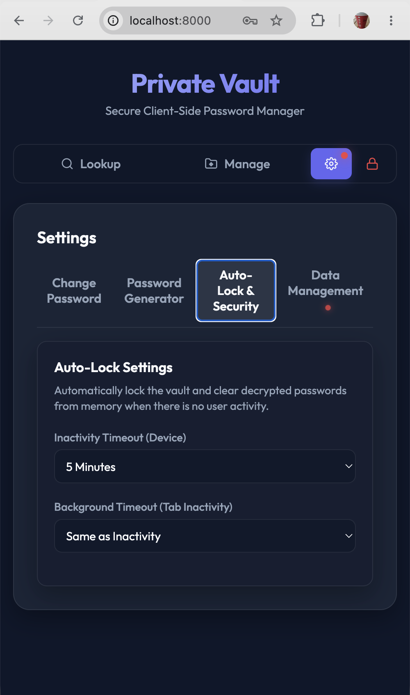 |
  | 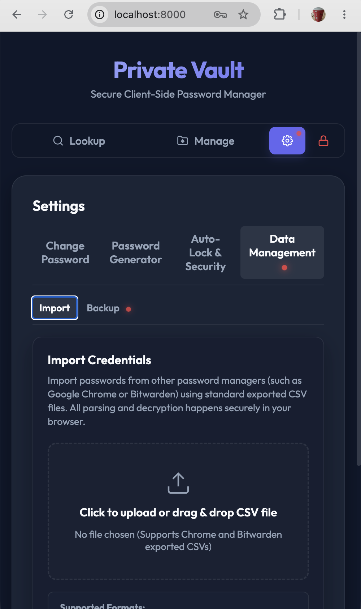 | 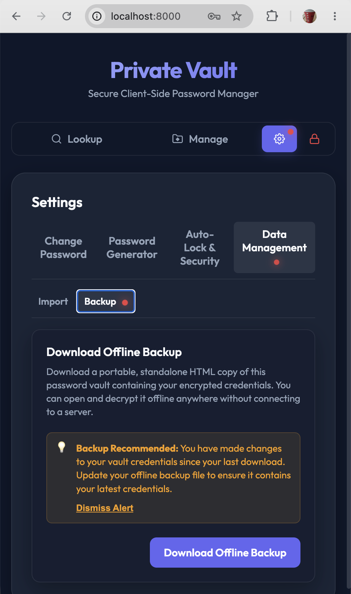 |
  | 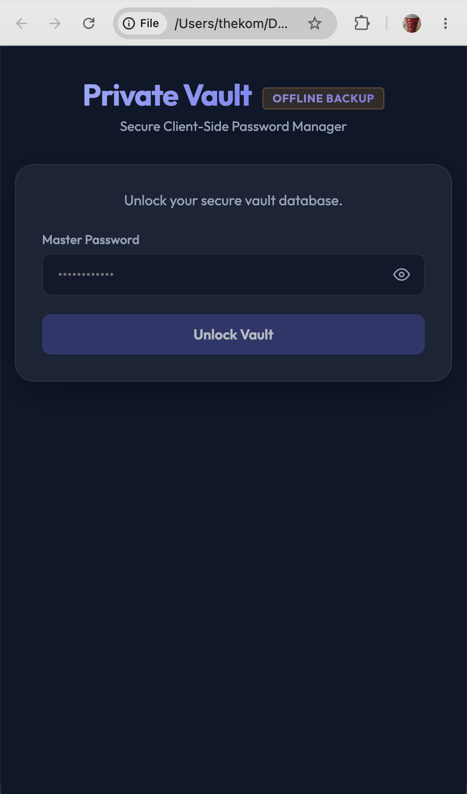 | 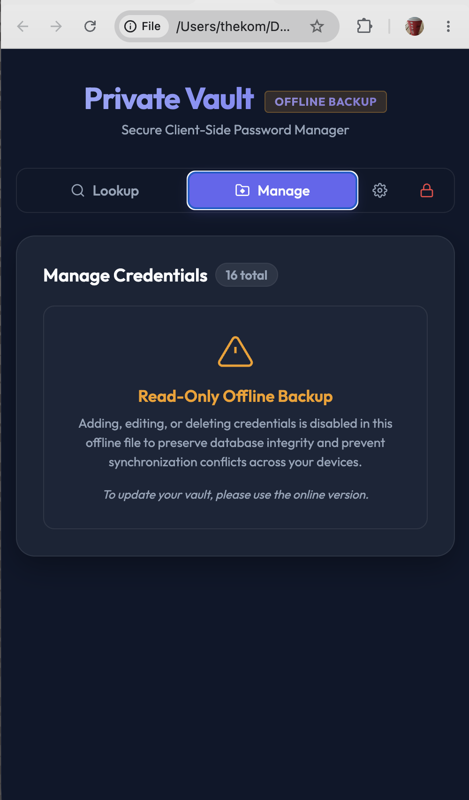 |
  | 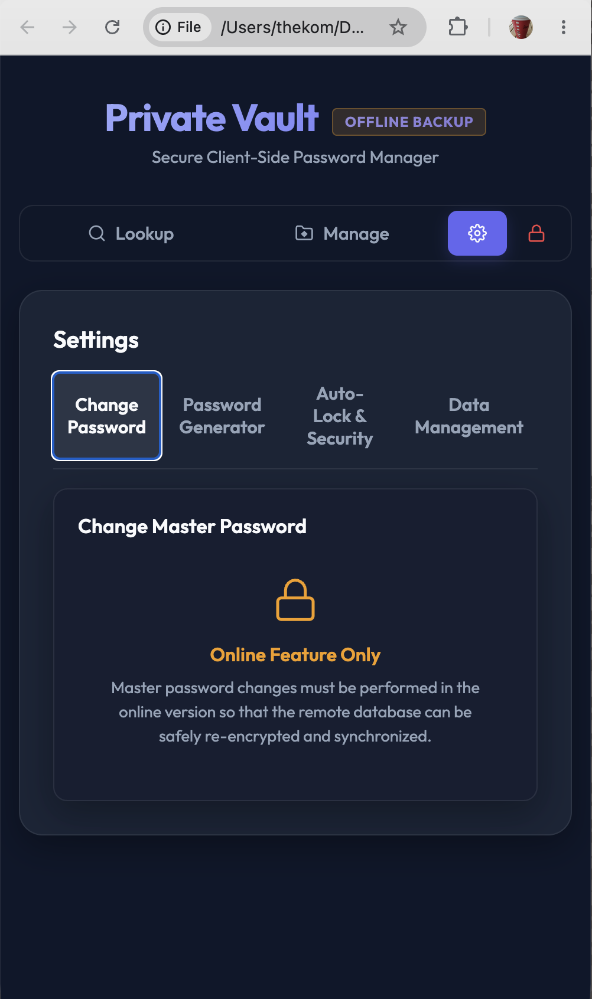 | 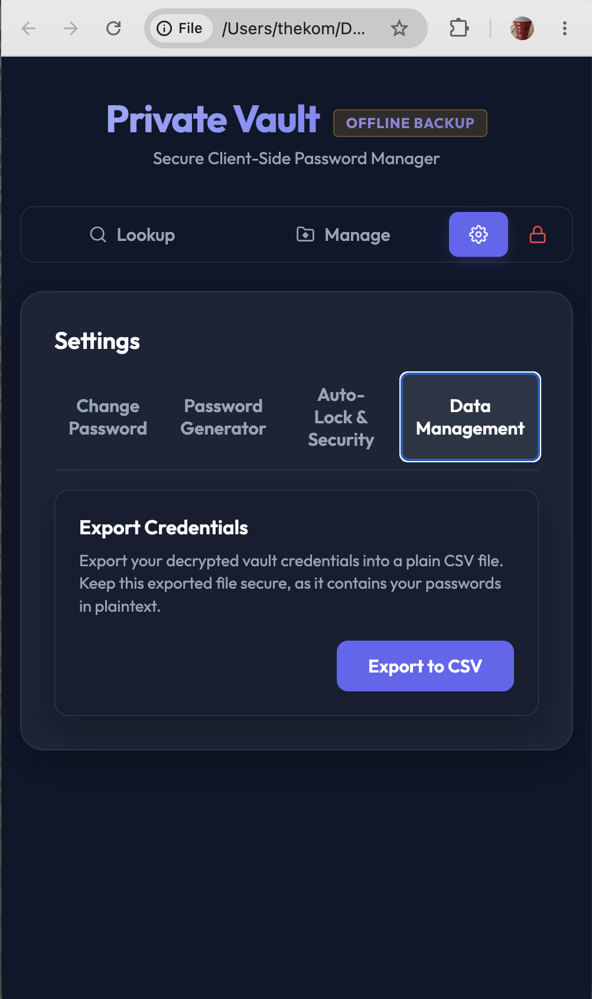 |
</details>

---

## 🔒 How it Works (Cryptography Architecture)

The Vault uses a **Two-Layer Encryption** model powered by the browser's native **Web Crypto API**. The server is completely blind to your plaintext credentials.

```
[ Master Password ] 
        │
        ▼ (PBKDF2-HMAC-SHA256 @ 600,000 Iterations)
[ Master Key ]
        │
        ▼ (Encrypts)
[ Random 256-bit Vault Key ] ◄──(Encrypts)──► [ Credentials JSON {"user", "pass"} ]
```

### 1. Key Derivation (Browser)
When you input your master password, the browser uses **PBKDF2-HMAC-SHA256** to derive:
*   **Master Key** (600,000 iterations): Used client-side to encrypt/decrypt the site-specific Vault Key.
*   **Verification Hash** (700,000 iterations): Sent to the server for authentication on write/list actions.

### 2. Two-Layer Symmetric Encryption (Browser)
*   For each credential record, the browser generates a random **256-bit AES Vault Key**.
*   The actual credentials (`username` and `password`) are encrypted by the **Vault Key** using **AES-256-GCM**.
*   The **Vault Key** is then encrypted by the **Master Key** using **AES-256-GCM**.
*   *Why two layers?* If you change your master password, the browser only needs to re-encrypt the Vault Keys. The actual site credentials remain untouched and are never exposed in plaintext during the change.

### 3. Verification & Server-Side Security (PHP)
*   For write operations, the browser transmits the *Verification Hash*.
*   The PHP backend checks this against the pre-configured hash using PHP's native, highly secure **Argon2id** algorithm (`password_verify()`). 
*   This achieves standard Argon2id security without requiring heavy, compiled WebAssembly or external JS libraries in the browser.

---

## 🛠️ Pragmatic Architecture (Why PHP?)

In modern development, using PHP for an API backend is sometimes questioned. However, this project is designed for **practical engineering and efficiency**:

*   **Zero Infrastructure Overhead**: Unlike Node.js, Go, or Python, which require background runtime processes, process managers (like PM2), or custom Docker configs, PHP is natively supported by virtually 100% of standard shared hosting servers (like cPanel) right out of the box.
*   **Stateless & Zero Maintenance**: PHP operates statelessly. You don't have to worry about memory leaks, keeping a daemon running, or updating server runtimes. It just works.
*   **Cost-Efficient Utility**: It utilizes your existing hosting resources with **zero incremental cost** and **zero extra bills**.
*   **Drag-and-Drop Deployment**: Deploying or backing up the backend is as simple as copying a directory.

---

## ✨ Features

*   **Zero Dependencies**: Written in pure, vanilla HTML5, CSS3, and ES6 JavaScript. No NPM packages, no bundlers, no framework rot.
*   **Premium Aesthetics**: Modern slate dark-mode UI with glassmorphism card layouts, smooth CSS transitions, and Outfit typography.
*   **Accordion Row Expansion**: Matches in the Lookup tab expand inline to reveal decrypted credential fields, accompanied by automated viewport scroll centering.
*   **Interactive Circular Timer**: Row-level SVG circular timer reset buttons that drain clockwise, allowing users to keep track of clipboard expirations and reset them instantly.
*   **Smart Account Grouping**: Identifies duplicates using neutral glassmorphic index tags (`#1`, `#2`) only when both the URL and the username are identical, preventing clutter across distinct accounts.
*   **Persistent Preferences**: Saves sort options, visible timeouts, auto-lock settings, and password generator configurations to `localStorage` to persist across logouts and page reloads.
*   **CSV Migration Mapping**: Client-side state-machine parser mapping Chrome/Bitwarden CSV exports directly into the vault schema without exposing data to external APIs.
*   **Offline Standalone Backups**: Downloads a fully functional single-file version (`private_vault_backup.html`) for air-gapped local decryption, viewing, and plain CSV exporting. Includes pulsing backup reminders in the online app when databases are updated.
*   **Security Auto-Locks**: Configurable inactivity timeouts and background tab thresholds to protect open vaults.
*   **Safe Autocomplete**: When the Manage tab is unlocked, site URLs are cached in memory to provide autocomplete suggestions in the Lookup tab.
*   **Clipboard Auto-Clear**: Copy buttons copy credentials and start a countdown. When the timer hits zero, the clipboard is automatically cleared.
*   **Self-Updating Setup Mode**: Guides you through configuring your initial master password, automatically writing the Argon2id hash to your configuration if the server is writable.
*   **In-Memory Session**: Unlocking the manager retains the derived keys in-memory. Locking or closing the tab instantly clears all keys.

---

## ⚠️ Limitations & Security Risks

While Private Vault is cryptographically robust, self-hosting a password manager has inherent tradeoffs:

### 1. No Password Recovery (The Zero-Trust Tradeoff)
There is no "Forgot Password" button. If you lose your master password, your **Master Key** cannot be derived, and the encrypted Vault Keys stored in the database become mathematically impossible to decrypt. **Your data will be permanently lost.**

### 2. Weak Master Password Risk (Offline Brute-Force)
If an attacker gains access to your server files, they can download the encrypted `vault.data.php` storage file. Although they cannot decrypt it directly, they can run an offline brute-force attack (dictionary attack) testing billions of combinations against the PBKDF2 hash. **You must use a strong, high-entropy master password.**

### 3. No Browser Autocomplete / Extension Auto-Fill
Since this is a simple self-hosted webpage, it does not integrate with your browser's auto-fill APIs or work across other tabs like browser extensions (e.g. Bitwarden/1Password). You must manually keep the vault tab open and click the copy-to-clipboard buttons.

### 4. Same-Origin Vulnerabilities (Cross-Site Scripting)
If you deploy this app in a subfolder of your main website (e.g., `company.com/private/pma`), any vulnerable script or WordPress plugin on your main site could read your manager's DOM or capture your master password. 
> [!IMPORTANT]
> **Always deploy this app on an isolated subdomain** (e.g., `pma.company.com`) to enforce Browser Origin Isolation.

---

## 🚀 Getting Started (Deployment)

Private Vault is designed to be extremely lightweight and requires **no database setup**. It runs on any standard web hosting environment that supports PHP 7.4+.

### 1. Clone the Repository
Clone the files to your local machine:
```bash
git clone https://github.com/thekomx/private-vault.git
cd private-vault
```

### 2. Upload Files
Upload the `index.html` and the `api/` directory from the repository to your web server (e.g., into your subdomain's document root).

### 3. Configure Permissions
Ensure that the `api/` directory is writable by the web server (e.g., folder permission `755` or `777` depending on your hosting provider). The application will automatically create the secure `vault.data.php` storage file when you configure your master password.

### 4. Initialize Master Password
Navigate to your subdomain URL in the browser. The page will detect that the vault is not yet initialized and open the **Vault Setup** wizard. Enter your chosen master password to finalize configuration!

---

### 🐳 Alternative: Deploy using Docker

If you prefer containerized environments, you can deploy Private Vault instantly using Docker. This automatically handles permission configuration and sets up persistent volume mounts.

1. **Start the Container**:
   Build the image and start the container in the background:
   ```bash
   docker compose up -d
   ```
2. **Initialize Your Vault**:
   Navigate to `http://localhost:8080` in your browser to access the setup wizard.
3. **Data Persistence**:
   The `docker-compose.yml` mounts the `./api` folder on your host machine as a volume, ensuring your vault data (`vault.data.php` and backups) is fully persisted across container restarts.
